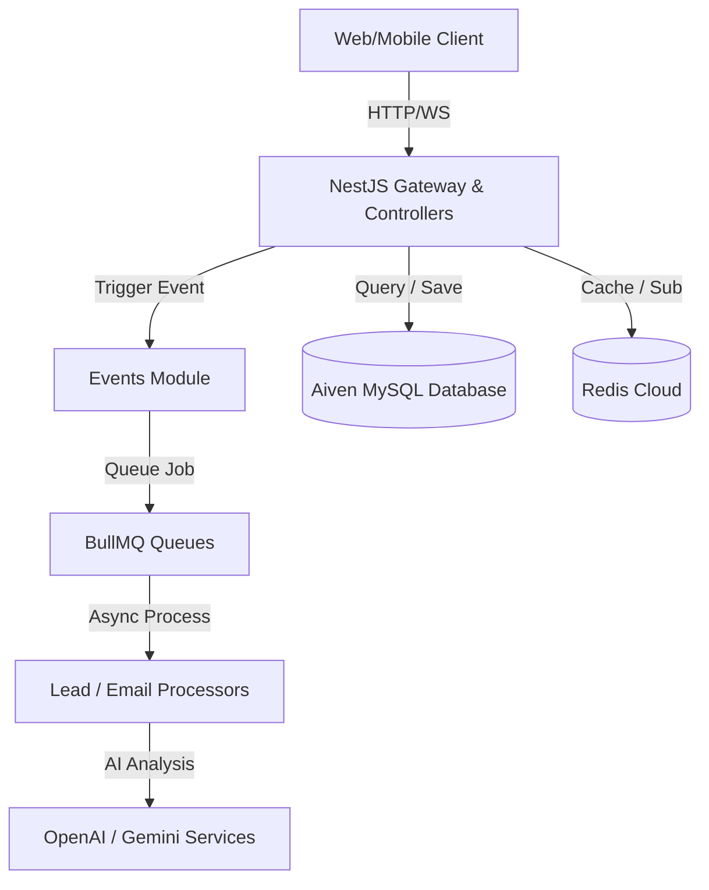

# Real Estate AI Platform Backend (MVP)

A production-ready NestJS backend for an AI-powered real estate platform. Designed with clean modular architecture, robust database indexing, background queues, AI qualification workflows, real-time communication, and secure deployment guidelines.

---

## Table of Contents
1. [Key Features](#key-features)
2. [Tech Stack](#tech-stack)
3. [Architecture Overview](#architecture-overview)
4. [Prerequisites](#prerequisites)
5. [Setup & Installation](#setup--installation)
6. [Seeding the Database](#seeding-the-database)
7. [Environment Variables](#environment-variables)
8. [API Endpoints Reference](#api-endpoints-reference)
9. [Prisma Studio Database Inspector](#prisma-studio-database-inspector)
10. [Testing](#testing)
11. [Deployment on Render](#deployment-on-render)

---

## Key Features
* **NestJS Modular Architecture**: Decoupled modules for maintainable, clean code.
* **Dual ORM Setup**: TypeORM for fast core operations/migrations, and **Prisma** for visual database management via Prisma Studio.
* **Multi-Role RBAC Support**: Authentication guards for `ADMIN`, `AGENT`, and `BUYER` roles.
* **Background Tasks (BullMQ)**: Managed email delivery, system notifications, and async AI workflows.
* **AI integrations (OpenAI & Gemini)**: Native handlers for conversational chat, extracting search intent, and lead priority scoring.
* **Real-time WebSockets**: Chat gateways configured with Redis Pub/Sub for cross-instance message synchronization.
* **Third-Party Mocking**: WhatsApp webhook receiver and verifier.
* **Cloudinary integration**: Cloud media storage for property photo uploads.

---

## Tech Stack
* **Runtime**: Node.js (v18+)
* **Framework**: NestJS (v11.x)
* **Databases**: MySQL (Primary storage on Aiven), Redis (Caching & Queues via Redis Cloud)
* **ORMs**: TypeORM (0.3+) & Prisma (7.x)
* **APIs**: Rest APIs, Swagger (OpenAPI 3), WebSockets (Socket.io)
* **External APIs**: OpenAI, Google Gemini, Cloudinary

---

## Architecture Overview
The application consists of independent modules communicating via NestJS Event Emitter and BullMQ queues:



---

## Prerequisites
* **Node.js** (v18 or v20/v24 recommended)
* **MySQL** or an active **Aiven MySQL** cloud instance
* **Redis** (local instance or **Redis Cloud** host)
* **Cloudinary** account credentials
* **OpenAI / Gemini** API keys

---

## Setup & Installation

1. **Clone the Repository**:
   ```bash
   git clone https://github.com/sirlawglobal/Smart-Real-Estate-Api.git
   cd Smart-Real-Estate-Api
   ```

2. **Install Dependencies**:
   ```bash
   npm install
   ```

3. **Configure Environment variables**:
   Create a `.env` file in the root directory (refer to the [Environment Variables](#environment-variables) section below for details).

4. **Initialize Prisma Client**:
   Ensure `DATABASE_URL` is configured in `.env`, then run:
   ```bash
   npx prisma generate
   ```

5. **Start Dev Server**:
   ```bash
   npm run start:dev
   ```

---

## Seeding the Database
The project contains a database seeder script. By default, it clears the tables and inserts a Super Admin user.

To run the seeding:
```bash
npm run seed
```

**Default Admin Credentials:**
* **Email**: `admin@realestate.com`
* **Password**: `Admin@123`

---

## Environment Variables

Configure these variables in your local `.env` file:

```env
# Application
NODE_ENV=development
PORT=3000
APP_NAME=RealEstate-AI-Platform
FRONTEND_URL=http://localhost:4000
ALLOWED_ORIGINS=http://localhost:4000,capacitor://localhost,http://localhost

# Databases
DB_HOST=mysql-xxxx.aivencloud.com
DB_PORT=11739
DB_USERNAME=avnadmin
DB_PASSWORD=your_password
DB_DATABASE=defaultdb
DB_SSL_CA=ca.pem
DB_SSL_REJECT_UNAUTHORIZED=true

# JWT Secrets
JWT_SECRET=your-super-secret-jwt-key
JWT_EXPIRES_IN=7d

# Redis Config (Redis Cloud / Managed)
REDIS_HOST=your-redis-cloud-host.redis.io
REDIS_PORT=17475
REDIS_PASSWORD=your_redis_password

# Cloudinary Integration
CLOUDINARY_CLOUD_NAME=your_cloudinary_name
CLOUDINARY_API_KEY=your_cloudinary_key
CLOUDINARY_API_SECRET=your_cloudinary_secret

# AI Providers
AI_PROVIDER=openai # openai | gemini
OPENAI_API_KEY=sk-proj-xxxx
OPENAI_MODEL=gpt-4o-mini
GEMINI_API_KEY=AIzaSyxxxx
GEMINI_MODEL=gemini-1.5-flash

# Email Configuration
MAIL_HOST=smtp.gmail.com
MAIL_PORT=587
MAIL_USER=your_email@gmail.com
MAIL_PASSWORD=your_app_password
MAIL_FROM="FX-App <your_email@gmail.com>"

# Webhooks
WHATSAPP_VERIFY_TOKEN=your_verify_token
```

---

## API Endpoints Reference

All REST endpoints are prefixed with `/api/v1`.

### 1. Authentication (`/api/v1/auth`)
| Method | Endpoint | Access | Description |
| :--- | :--- | :--- | :--- |
| `POST` | `/auth/register` | Public | Register a new user |
| `POST` | `/auth/login` | Public | Authenticate a user and return a JWT token |
| `POST` | `/auth/logout` | User | Invalidate the current session token |
| `POST` | `/auth/forgot-password` | Public | Generate a password reset UUID token |
| `POST` | `/auth/reset-password` | Public | Reset password using the generated UUID token |
| `GET` | `/auth/me` | User | Get current logged-in user profile |
| `PATCH` | `/auth/change-password` | User | Update user password |

### 2. Properties (`/api/v1/properties`)
| Method | Endpoint | Access | Description |
| :--- | :--- | :--- | :--- |
| `GET` | `/properties` | Public | List all approved properties (supports pagination/filtering) |
| `GET` | `/properties/featured` | Public | Retrieve featured real estate listings |
| `GET` | `/properties/search` | Public | Search properties based on criteria |
| `GET` | `/properties/my-properties` | Agent/Admin | Fetch listings created by the logged-in Agent |
| `GET` | `/properties/:id` | Public | Get detailed view of a property |
| `POST` | `/properties` | Agent/Admin | Submit a new property listing (defaults to PENDING) |
| `PATCH` | `/properties/:id` | Agent/Admin | Update properties details |
| `DELETE` | `/properties/:id` | Agent/Admin | Soft delete listing |
| `POST` | `/properties/:id/images` | Agent/Admin | Upload property photos to Cloudinary (Multipart) |
| `DELETE` | `/properties/:id/images/:imageId` | Agent/Admin | Remove property photo |

### 3. Leads & Qualification (`/api/v1/leads`)
| Method | Endpoint | Access | Description |
| :--- | :--- | :--- | :--- |
| `POST` | `/leads` | Public | Submit interest in a property (creates a lead) |
| `GET` | `/leads` | Agent/Admin | List all leads |
| `GET` | `/leads/my-leads` | Agent | Retrieve leads assigned to the logged-in agent |
| `GET` | `/leads/hot` | Agent/Admin | Retrieve leads flagged with high AI qualification score |
| `GET` | `/leads/:id` | Agent/Admin | Get detailed view of a single lead |
| `PATCH` | `/leads/:id/status` | Agent/Admin | Manually modify lead status (contacted, qualified, closed, etc.) |

### 4. Conversations & Chats (`/api/v1/conversations`, `/api/v1/chat`)
| Method | Endpoint | Access | Description |
| :--- | :--- | :--- | :--- |
| `GET` | `/conversations` | User | Retrieve all active chats for the current user |
| `GET` | `/conversations/:id` | User | Retrieve full message logs of a conversation |
| `POST` | `/conversations/:id/messages` | User | Send a message within a specific chat room |
| `POST` | `/chat/send` | User | General send endpoint for messages |
| `GET` | `/chat/webhook/whatsapp` | Public | Verify WhatsApp API webhook handshake |
| `POST` | `/chat/webhook/whatsapp` | Public | Receive incoming messages from WhatsApp integration |

### 5. Dashboard & Analytics (`/api/v1/dashboard`, `/api/v1/analytics`)
| Method | Endpoint | Access | Description |
| :--- | :--- | :--- | :--- |
| `GET` | `/dashboard/stats` | Agent/Admin | Retrieve general counts, average prices, and ratios |
| `GET` | `/dashboard/recent` | Agent/Admin | Retrieve list of recent user registrations, properties, and leads |
| `GET` | `/analytics/leads` | Agent/Admin | Fetch lead-specific stats (statuses, priority counts) |

### 6. Favorites (`/api/v1/favorites`)
| Method | Endpoint | Access | Description |
| :--- | :--- | :--- | :--- |
| `GET` | `/favorites` | Buyer/Agent/Admin | List current user's favorited properties |
| `POST` | `/favorites/:propertyId` | Buyer/Agent/Admin | Favorite a listing |
| `DELETE` | `/favorites/:propertyId` | Buyer/Agent/Admin | Remove listing from favorites |

### 7. Notifications (`/api/v1/notifications`)
| Method | Endpoint | Access | Description |
| :--- | :--- | :--- | :--- |
| `GET` | `/notifications` | User | Fetch system alerts for user |
| `PATCH` | `/notifications/read-all` | User | Mark all incoming notifications as read |
| `PATCH` | `/notifications/:id/read` | User | Mark a single notification as read |

### 8. AI Orchestration (`/api/v1/ai`)
| Method | Endpoint | Access | Description |
| :--- | :--- | :--- | :--- |
| `POST` | `/ai/chat` | Public | Submit prompt to AI agent for general recommendations |
| `POST` | `/ai/extract-intent` | Public | Parse chat inputs for structured search intents (budget, bedroom count, location) |
| `POST` | `/ai/recommendations` | Public | Retrieve properties list generated by AI recommendation algorithms |
| `POST` | `/ai/qualify-lead` | User | Run automated qualification analysis on a lead payload |

### 9. System Health Check (`/api/v1/health`)
| Method | Endpoint | Access | Description |
| :--- | :--- | :--- | :--- |
| `GET` | `/health` | Public | Database connectivity check (`SELECT 1`) to keep connection warm |

---

## Prisma Studio Database Inspector
To inspect database records visually through your web browser:
1. Ensure your `.env` contains the valid `PRISMA_DATABASE_URL`.
2. Start the database inspector:
   ```bash
   npx prisma studio
   ```
3. Open **[http://localhost:5555](http://localhost:5555)** (or the port specified in terminal output) in your web browser.

---

## Testing

* **Run Unit Tests**:
  ```bash
  npm run test
  ```

* **Run E2E Tests**:
  ```bash
  npm run test:e2e
  ```

---

## Deployment on Render

1. Create a **Web Service** on Render pointing to your GitHub repository.
2. In **Environment**, configure all keys listed under the `.env` section (use `ca.pem` for `DB_SSL_CA`).
3. Click **Add Secret File**, set the filename to `ca.pem`, and paste your Aiven CA certificate text.
4. Set the **Start Command** to:
   ```bash
   npm run start:prod
   ```
5. Click deploy. Render will automatically compile the TypeScript files and boot the NestJS service.
